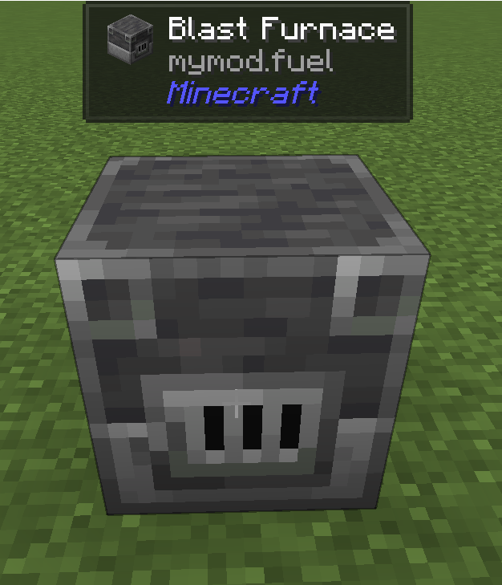
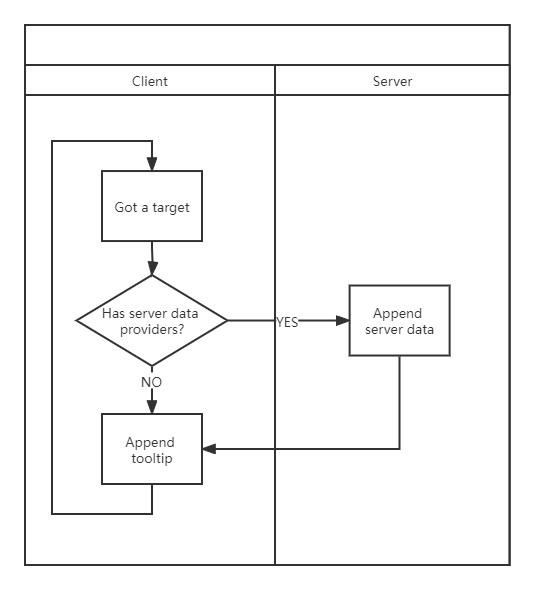
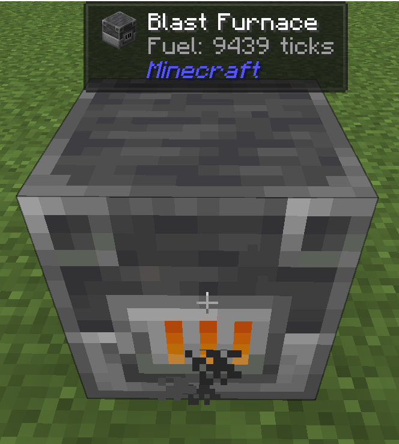
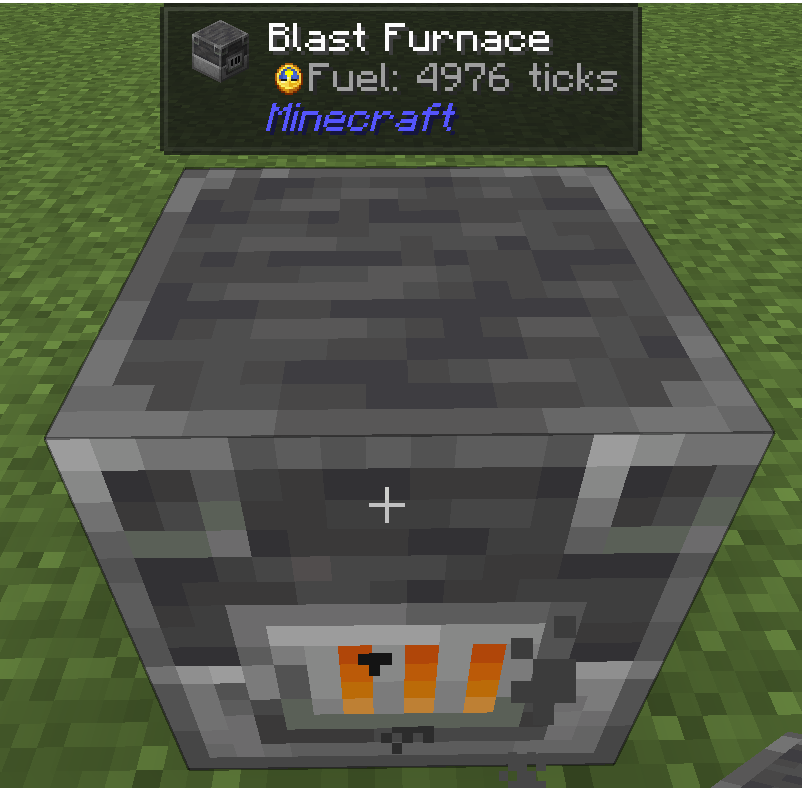

# Getting Started

## Setup

=== "Fabric"

    In your `build.gradle`:

    ```groovy
    repositories {
      maven { url = "https://api.modrinth.com/maven" }
    }

    dependencies {
      // jade_version example: 26.0.0+fabric
      // Visit https://modrinth.com/mod/jade/versions?l=fabric to get the latest version
      implementation "maven.modrinth:jade:${project.jade_version}"
    }
    ```

=== "NeoForge"

    In your `build.gradle`:

    ```groovy
    repositories {
      maven { url = "https://api.modrinth.com/maven" }
    }

    dependencies {
      // jade_version example: 26.0.0+neoforge
      // Visit https://modrinth.com/mod/jade/versions?l=neoforge to get the latest version
      implementation "maven.modrinth:jade:${project.jade_version}"
    }
    ```

Visit [Modrinth Maven](https://support.modrinth.com/en/articles/8801191-modrinth-maven/) to find more information about how to set up your workspace.

## Registering your plugin

```java
package snownee.jade.test;

import snownee.jade.api.IWailaClientRegistration;
import snownee.jade.api.IWailaCommonRegistration;
import snownee.jade.api.IWailaPlugin;
import snownee.jade.api.WailaPlugin;

@WailaPlugin
public class ExamplePlugin implements IWailaPlugin {

  @Override
  public void register(IWailaCommonRegistration registration) {
    //TODO register data providers and hiding things here
  }

  @Override
  public void registerClient(IWailaClientRegistration registration) {
    //TODO register component providers, icon providers, callbacks, and config options here
  }
}
```

!!! note

    For Fabric user, you need to add entrypoints in your `fabric.mod.json`

    ``` json
    {
      "entrypoints": {
        "jade": [
          "full.class.path.to.ExamplePlugin"
        ]
      }
    }
    ```

## Component Provider

Component providers can append information (texts or images) to the tooltip.

Let's create a simple block component provider that adds an extra line to all the furnaces:

```java
package snownee.jade.test;

import net.minecraft.network.chat.Component;
import net.minecraft.resources.Identifier;
import snownee.jade.api.BlockAccessor;
import snownee.jade.api.IBlockComponentProvider;
import snownee.jade.api.ITooltip;
import snownee.jade.api.config.IPluginConfig;

public class ExampleComponentProvider implements IBlockComponentProvider {
  public static final ExampleComponentProvider INSTANCE = new ExampleComponentProvider();

  @Override
  public void appendTooltip(
    ITooltip tooltip,
    BlockAccessor accessor,
    IPluginConfig config
  ) {
    tooltip.add(Component.translatable("mymod.fuel"));
  }

  @Override
  public Identifier getUid() {
    return ExamplePlugin.FURNACE_FUEL;
  }
}
```

Here you have the `tooltip` that you can do many various operations to the tooltip. You can take the `tooltip` as a list of `Component`. But here our elements are `IElement`s, to support displaying images, not just texts. In this case we only added a single line.

You also have the `accessor`, which you can get access to the context. We will use it later.

Then register our `ExampleComponentProvider`:

```java
@Override
public void registerClient(IWailaClientRegistration registration) {
  registration.registerBlockComponent(ExampleComponentProvider.INSTANCE, AbstractFurnaceBlock.class);
}
```

`AbstractFurnaceBlock.class` means we will append our text only when the block is extended from `AbstractFurnaceBlock`.

Once your component provider is registered, Jade will create a config option for the user to toggle the provider. So don't forget to add translation for your option.

!!! note

    To control element insertion positions, override the `getDefaultPriority` method in the component provider. Higher values indicate lower priority. Values ranging from -5000 to 5000 are suitable for regular providers, which will be collapsed in compact mode.

Now launch the game:



Congrats, you have implemented your first Jade plugin!

## Server Data Provider

`IServerDataProvider` can help you sync data that is not on client side. In this tutorial it is the remaining burn time of the furnace. It will sync to the client every 250 milliseconds.

This is a chart shows the basic lifecycle:



It's time to implement our `IServerDataProvider`. Typically, we'll use `StreamServerDataProvider` to simplify the implementation and enable data encoding/decoding with `StreamCodec`:

```java
package snownee.jade.test;

import org.jspecify.annotations.Nullable;

import net.minecraft.network.RegistryFriendlyByteBuf;
import net.minecraft.network.codec.ByteBufCodecs;
import net.minecraft.network.codec.StreamCodec;
import net.minecraft.resources.Identifier;
import net.minecraft.world.level.block.entity.AbstractFurnaceBlockEntity;
import snownee.jade.api.BlockAccessor;
import snownee.jade.api.StreamServerDataProvider;

public class ExampleDataProvider
  implements StreamServerDataProvider<BlockAccessor, Integer> {
  public static final ExampleDataProvider INSTANCE = new ExampleDataProvider();

  @Override
  public @Nullable Integer streamData(BlockAccessor accessor) {
		return accessor.<AbstractFurnaceBlockEntity>typedBlockEntity().litTimeRemaining;
  }

  @Override
  public StreamCodec<RegistryFriendlyByteBuf, Integer> streamCodec() {
    return ByteBufCodecs.VAR_INT.cast();
  }

  @Override
  public Identifier getUid() {
    return ExamplePlugin.FURNACE_FUEL;
  }
}
```

Here we used [Access Transformers](https://docs.neoforged.net/docs/advanced/accesstransformers) or [Access Wideners](https://fabricmc.net/wiki/tutorial:accesswideners) to get access to the protected field.

Registering `IServerDataProvider`:

```java
@Override
public void register(IWailaCommonRegistration registration) {
	registration.registerBlockDataProvider(ExampleDataProvider.INSTANCE, AbstractFurnaceBlockEntity.class);
}
```

!!! note

    Data providers may have the same or different identifiers as component providers.

Changes are made on our `ExampleComponentProvider` to get the data from the server:

```java
package snownee.jade.test;

import java.util.Optional;

import net.minecraft.network.chat.Component;
import net.minecraft.resources.Identifier;
import snownee.jade.api.BlockAccessor;
import snownee.jade.api.IBlockComponentProvider;
import snownee.jade.api.ITooltip;
import snownee.jade.api.config.IPluginConfig;

public class ExampleComponentProvider implements IBlockComponentProvider {
  public static final ExampleComponentProvider INSTANCE = new ExampleComponentProvider();

  @Override
  public void appendTooltip(
    ITooltip tooltip,
    BlockAccessor accessor,
    IPluginConfig config
  ) {
    Optional<Integer> fuel = ExampleDataProvider.INSTANCE.decodeFromData(accessor);
    if (fuel.isPresent()) {
      tooltip.add(Component.translatable("mymod.fuel", fuel.get()));
    }
  }

  @Override
  public Identifier getUid() {
    return ExamplePlugin.FURNACE_FUEL;
  }
}
```

Lastly, don't forget to add the translations:

```json
{
  "config.jade.plugin_mymod.furnace_fuel": "Test",
  "mymod.fuel": "Fuel: %d ticks"
}
```

Great!



## Showing an Item

Now let's show a clock as a small icon:

```java
@Override
public void appendTooltip(
  ITooltip tooltip,
  BlockAccessor accessor,
  IPluginConfig config
) {
  Optional<Integer> fuel = ExampleDataProvider.INSTANCE.decodeFromData(accessor);
  if (fuel.isPresent()) {
    Element icon = JadeUI.smallItem(new ItemStack(Items.CLOCK));
    tooltip.add(icon);
    tooltip.append(Component.translatable("mymod.fuel", fuel.get()));
  }
}
```

Result:



!!! note

    See methods in `JadeUI` to check more elements that can be added to tooltips. You can also add screen widgets to tooltips.