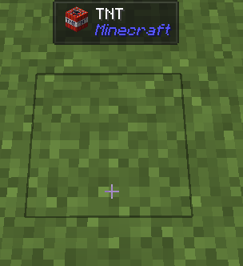

# Overrides

You can add a `JadeRayTraceCallback` to replace the ray-trace result. New result can be created from `IWailaClientRegistration` in the `IWailaPlugin#registerClient` method.

Here is a small example that displays grass block as TNT block:

```java
@Override
public void registerClient(IWailaClientRegistration registration) {
	registration.addRayTraceCallback((hitResult, accessor, originalAccessor) -> {
		if (accessor instanceof BlockAccessor blockAccessor && blockAccessor.getBlock() == Blocks.GRASS_BLOCK) {
			return registration.blockAccessor()
				.from(blockAccessor)
				.blockState(Blocks.TNT.defaultBlockState())
				.build();
		}
		return accessor;
	});
}
```

Result:


