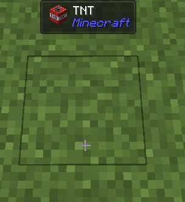

# Overrides

!!! note

    Before talking about overrides. If you are looking for a way to show the "correct" name of a block, you probably actually need `IWailaClientRegistration#usePickedResult`

You can add a `JadeRayTraceCallback` to replace the ray-trace result. New result can be created from `IWailaClientRegistration` in the `IWailaPlugin#registerClient` method.

Here is a small example that displays grass block as TNT block:

``` java
@Override
public void registerClient(IWailaClientRegistration registration) {
	registration.addRayTraceCallback((hitResult, accessor, originalAccessor) -> {
		if (accessor instanceof BlockAccessor blockAccessor) {
			if (blockAccessor.getBlock() == Blocks.GRASS_BLOCK) {
				return registration.blockAccessor().from(blockAccessor).blockState(Blocks.TNT.defaultBlockState()).build();
			}
		}
		return accessor;
	});
}
```

Result:

