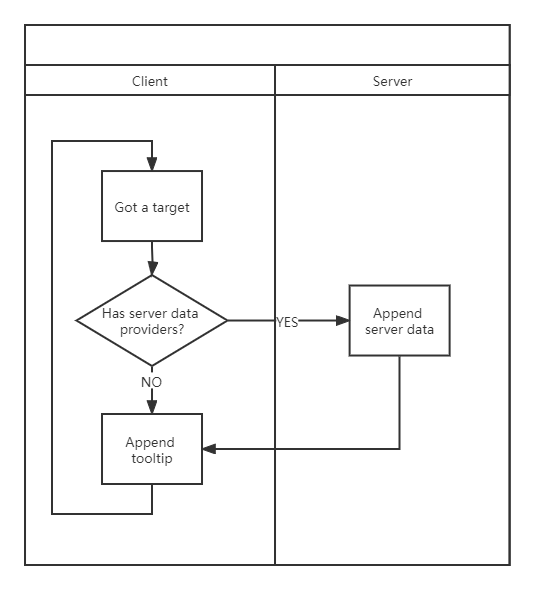
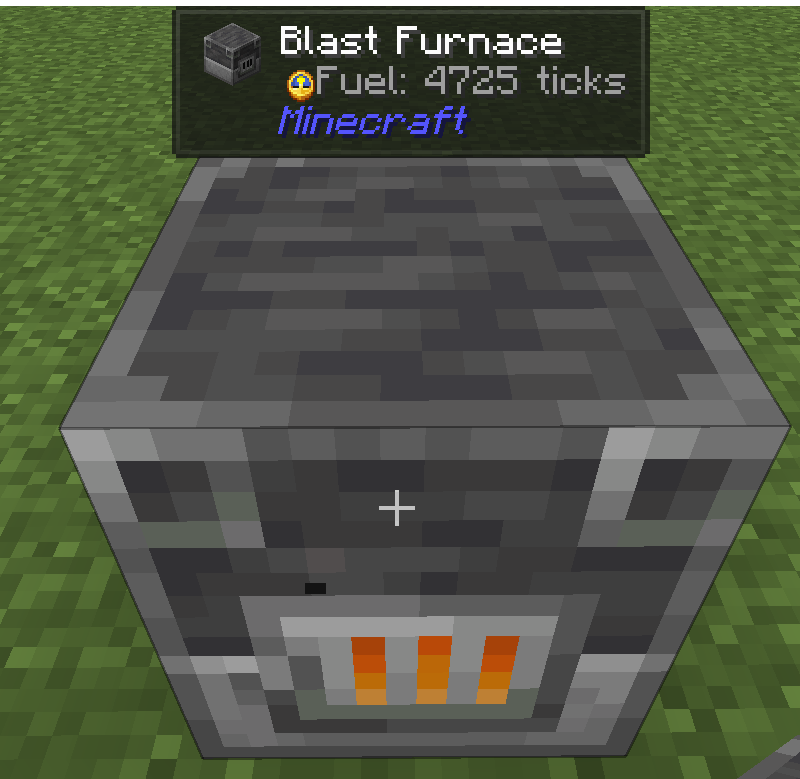
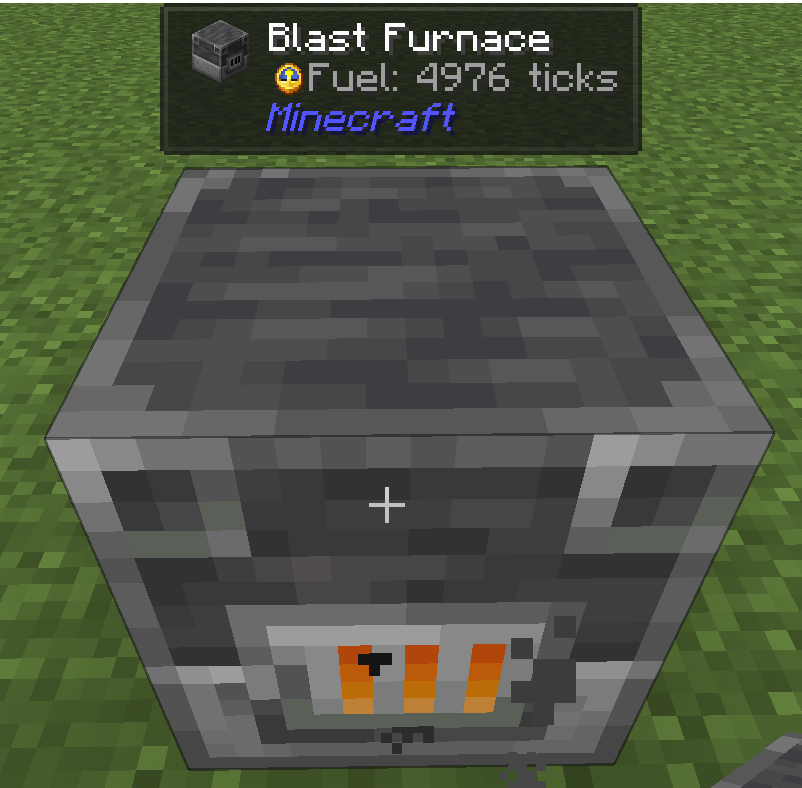

# Getting Started

## Setup

=== "Forge"

	In your `build.gradle`:

	``` groovy
	repositories {
		maven {
			url "https://www.cursemaven.com"
			content {
				includeGroup "curse.maven"
			}
		}
	}

	dependencies {
		// Visit https://www.curseforge.com/minecraft/mc-mods/jade/files/all?filter-status=1&filter-game-version=2020709689%3A7498
		// to get the latest version's jade_id
		implementation fg.deobf("curse.maven:jade-324717:${jade_id}")
	}
	```

=== "Fabric"

	In your `build.gradle`:

	``` groovy
	repositories {
		maven {
			url "https://www.cursemaven.com"
			content {
				includeGroup "curse.maven"
			}
		}
	}

	dependencies {
		// Visit https://www.curseforge.com/minecraft/mc-mods/jade/files/all?filter-status=1&filter-game-version=2020709689%3A7499
		// to get the latest version's jade_id
		modImplementation "curse.maven:jade-324717:${jade_id}"
	}
	```

Visit [CurseMaven](https://www.cursemaven.com/) to find more information about how to set up your workspace.

## Registering

``` java
package snownee.jade.test;

import snownee.jade.api.IWailaClientRegistration;
import snownee.jade.api.IWailaCommonRegistration;
import snownee.jade.api.IWailaPlugin;
import snownee.jade.api.WailaPlugin;

@WailaPlugin
public class ExamplePlugin implements IWailaPlugin {

	@Override
	public void register(IWailaCommonRegistration registration) {
		//TODO register data providers
	}

	@Override
	public void registerClient(IWailaClientRegistration registration) {
		//TODO register component providers, icon providers, callbacks, and config options here
	}

}
```

!!! note

    For Fabric edition, you need to add entrypoints in your `fabric.mod.json`

    ``` json
    {
      "entrypoints": {
        "jade": [
          "{your full class path here}",
          "snownee.jade.addon.vanilla.VanillaPlugin",
          "snownee.jade.addon.universal.UniversalPlugin"
        ]
      }
    }
    ```

## Component Provider

Component providers can append information (texts or images) to the tooltip.

Let's create a simple block component provider that adds an extra line to all the furnaces:

``` java
package snownee.jade.test;

import net.minecraft.network.chat.Component;
import net.minecraft.resources.ResourceLocation;
import snownee.jade.api.BlockAccessor;
import snownee.jade.api.IBlockComponentProvider;
import snownee.jade.api.ITooltip;
import snownee.jade.api.config.IPluginConfig;

public enum ExampleComponentProvider implements IBlockComponentProvider {

	INSTANCE;

	@Override
	public void appendTooltip(ITooltip tooltip, BlockAccessor accessor, IPluginConfig config) {
		tooltip.append(Component.translatable("mymod.fuel"));
	}

	@Override
	public ResourceLocation getUid() {
		return ExamplePlugin.FURNACE_FUEL;
	}

}
```

Here you have the `tooltip` that you can do many various operations to the tooltip. You can take the `tooltip` as a list of `Component`. But here our elements are `IElement`s, to support displaying images, not just texts. In this case we only added a single line.

You also have the `accessor`, which you can get access to the context. We will use it later.

Then register our `ExampleComponentProvider`:

``` java
@Override
public void registerClient(IWailaClientRegistration registration) {
	registration.registerBlockComponent(ExampleComponentProvider.INSTANCE, AbstractFurnaceBlock.class);
}
```

`AbstractFurnaceBlock.class` means we will append our text only when the block is extended from `AbstractFurnaceBlock`.

!!! note

    If you want to control the position your elements are inserted, you can override `getDefaultPriority` method in your component provider. Greater is lower. -5000 ~ 5000 is for normal providers and they will be folded in the Lite mode.

Now launch the game:


Congrats you have implemented your first Jade plugin!

## Server Data Provider

`IServerDataProvider` can help you sync data that is not on client side. In this tutorial it is the remaining burn time of the furnace. It will sync to the client every 250 milliseconds.

This is a chart shows the basic lifecycle:



Now it's time to implement our `IServerDataProvider`:

``` java
package snownee.jade.test;

import net.minecraft.nbt.CompoundTag;
import net.minecraft.network.chat.Component;
import net.minecraft.resources.ResourceLocation;
import net.minecraft.server.level.ServerPlayer;
import net.minecraft.world.level.Level;
import net.minecraft.world.level.block.entity.AbstractFurnaceBlockEntity;
import net.minecraft.world.level.block.entity.BlockEntity;
import snownee.jade.api.BlockAccessor;
import snownee.jade.api.IBlockComponentProvider;
import snownee.jade.api.IServerDataProvider;
import snownee.jade.api.ITooltip;
import snownee.jade.api.config.IPluginConfig;

public enum ExampleComponentProvider implements IBlockComponentProvider, IServerDataProvider<BlockEntity> {

	INSTANCE;

	@Override
	public void appendTooltip(ITooltip tooltip, BlockAccessor accessor, IPluginConfig config) {
		if (accessor.getServerData().contains("Fuel")) {
			tooltip.append(Component.translatable("mymod.fuel", accessor.getServerData().getInt("Fuel")));
		}
	}

	@Override
	public void appendServerData(CompoundTag data, ServerPlayer player, Level world, BlockEntity t, boolean showDetails) {
		AbstractFurnaceBlockEntity furnace = (AbstractFurnaceBlockEntity) t;
		data.putInt("Fuel", furnace.litTime);
	}

	@Override
	public ResourceLocation getUid() {
		return ExamplePlugin1.FURNACE_FUEL;
	}

}
```

Here we used [Access Transformer](https://forge.gemwire.uk/wiki/Access_Transformers) or [Access Wideners](https://fabricmc.net/wiki/tutorial:accesswideners) to get access to the protected field.

Register `IServerDataProvider`:

``` java
@Override
public void register(IWailaCommonRegistration registration) {
	registration.registerBlockDataProvider(ExampleComponentProvider.INSTANCE, AbstractFurnaceBlockEntity.class);
}
```

Don't forget to add translations:

``` json
{
  "config.jade.plugin_mymod.furnace_fuel": "Test",
  "mymod.fuel": "Fuel: %d ticks"
}
```

Great!


## Showing an Item

Now let's show a clock as a small icon:

``` java
@Override
public void appendTooltip(ITooltip tooltip, BlockAccessor accessor, IPluginConfig config) {
	if (accessor.getServerData().contains("Fuel")) {
		IElementHelper elements = tooltip.getElementHelper();
		IElement icon = elements.item(new ItemStack(Items.CLOCK), 0.5f);
		tooltip.add(icon);
		tooltip.append(Component.translatable("mymod.fuel", accessor.getServerData().getInt("Fuel")));
	}
}
```

Result:



Hmmm, would be better if we do some fine-tuning:

``` java 
@Override
public void appendTooltip(ITooltip tooltip, BlockAccessor accessor, IPluginConfig config) {
	if (accessor.getServerData().contains("Fuel")) {
		IElementHelper elements = tooltip.getElementHelper();
		IElement icon = elements.item(new ItemStack(Items.CLOCK), 0.5f).size(new Vec2(10, 10)).translate(new Vec2(0, -1));
		tooltip.add(icon);
		tooltip.append(Component.translatable("mymod.fuel", accessor.getServerData().getInt("Fuel")));
	}
}
```

Result:



Much better now!

## Improving Accessibility

Jade has a feature that allows user to narrate the tooltip (press keypad 5 by default). Now the problem is we don't want our clock icon to be narrated. So we can clear the narratable message in this way:

``` java
@Override
public void appendTooltip(ITooltip tooltip, BlockAccessor accessor, IPluginConfig config) {
	if (accessor.getServerData().contains("Fuel")) {
		IElementHelper elements = tooltip.getElementHelper();
		IElement icon = elements.item(new ItemStack(Items.CLOCK), 0.5f).size(new Vec2(10, 10)).translate(new Vec2(0, -1));
		icon.message(null);
		tooltip.add(icon);
		tooltip.append(Component.translatable("mymod.fuel", accessor.getServerData().getInt("Fuel")));
	}
}
```
